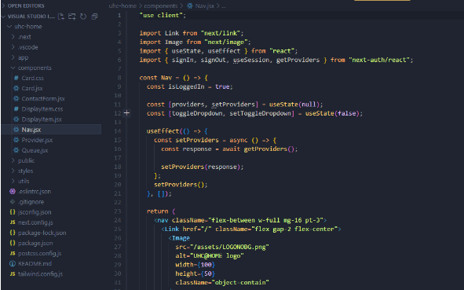
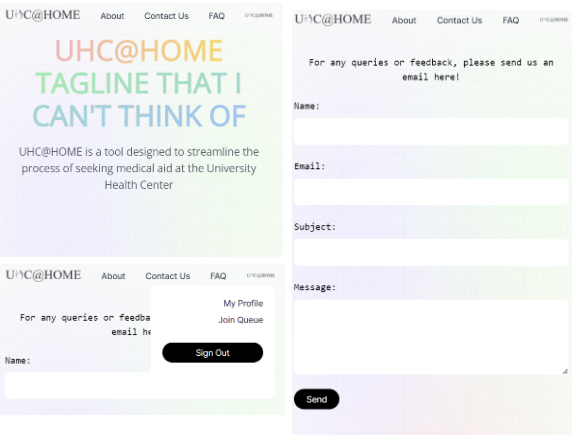
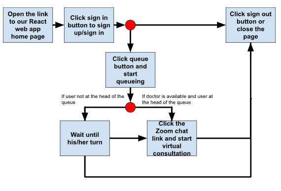

# UHC-HOME

## Orbital 2023 Milestone 1

## Team Name

UHC@HOME

### Team ID

5955

### Team Members

- Jaeho Jeong
- Tan Shen Nathanael Mark

### Proposed Level of Achievement

Apollo 11

### Code Base

Link to repository:
https://github.com/itsNatTan/UHC-HOME

### Project Pitch (Liftoff)

- Pitch Poster:
  https://drive.google.com/file/d/1sfzmMaTVh0PClR47jn2xdpVWLRlvCC4T/view?usp=share_link
- Pitch Video:
  https://drive.google.com/file/d/19jx5SllhcOVJqyTKHaY38GMat9WlI9WW/view?usp=share_link

### Milestone 1

- Milestone 1 Poster:
  https://drive.google.com/file/d/1X9JEe8-_wZUj2m3UHfqwy7PVDyRAxZqB/view?usp=sharing
- Milestone 1 Video:
  https://drive.google.com/file/d/14wDlenqoPLemmd-6agQmLaezBDzq8S0f/view?usp=sharing

### Project Motivation

- UHC is the place NUS students go to whenever we feel unwell and need doctor consultations and medication. However, oftentimes the queue is far too long, needlessly increasing the time spent at the clinic. It takes time to do registration in person in order to verify student status and to do relevant paperwork for medical chart entry. We simply cannot see the end of queueing, getting out of queue for consultations only to find ourselves queueing yet again for medicine prescriptions.

- However, what if you are terribly ill, down with an infectious illness, find it difficult to queue for long, or are in desperate need of medicines. What if we could access this healthcare service in the comfort of your home and perhaps make the queueing process faster? Shouldn’t there be a way to virtually get consulted? What if another virus were to break out and it is difficult to facilitate influx of the sick and unwise to have so many waiting in one confined space?

### Aim of Project

- We aim to make an app that will enable virtual consultations for UHC. The app would allow doctors to connect with NUS student patients virtually via Zoom call. Instead of implementing a video call feature directly in our app, which requires extensive development, students would be given a Zoom conference link to do a video call.

- Furthermore, in light of the recent pandemic, we find it increasingly important to create measures to allow our healthcare system to remain robust in times of tumult, where a virtual setting would be safer. It would also be difficult to accommodate a large number of the sick queueing up while preserving social distancing.

### User Stories

- As a student, I want to be able to have a doctor’s consultation in the comfort of my home without wasting traveling time to cope with a busy school schedule.
- As a commuting student in particular, I want to be able to enjoy the UHC services from afar instead of traveling all the way to UHC from home.
- As a doctor, I want to be able to see as many patients as possible with minimal delay. This app will allow me to connect instantly with my patients while saving them the travel.
- As an administrator, I want a system that can easily track the number of people queueing and allow automatic handling of patients and potentially reduce unnecessary labor costs.

### Tech Stack

- React/Next.js:
  Using React hooks and a collection of JS, CSS, and JSX files
- PostgresSQL:
  Database system for storing user login ID and password as well as live updating the number of people in the queue for UHC consultations
- GitHub/GitHub Desktop:
  Source Control
- Postman:
  To be used for backend testing, sending requests to the server, and receiving the response back from the server,
  To connect to PostgresSQL database and allow pulling of data
- Telegram chatbot API/TeleBot package:
  Additional feature to be added later for dealing with commonly asked questions and providing answers and guidance

### Technical documentation

- We decided to use Next.js, as it is a recently introduced tool that makes web development much simpler. By using Next.js, any children folders of the app folder becomes the directory link name that can be used for routing, much easier than how routing can be implemented in normal React and node.js usage.
- We used layout.jsx file to set a standardized rendered structure for all children files of the app folder so that the navigation bar is always at the top of the page and the children page content gets displayed below the nav bar.

- One of the children files of the app folder is the page.jsx, used for home page content.

- By creating components, they can be reused in each individual page. For instance, this Nav.jsx component can be placed in the Layout.jsx in the app folder, such that every page in the folder will have the navigation bar without a need to create it again for each page.
- States allow us to create dynamic and interactive components without the need for re-rendering the entire page. React will re-render that specific component to update the state, reducing the amount of rendering and hence speed.

### Screenshots of currently updated project (Dynamic web sizing implemented)

When in big screen mode:  

- When in large screen, all the nav bar buttons are displayed fully.
  Once each page button of the nav bar is clicked, it’s routed to a new page with the respective pages that serve the purpose of their names.

When in small screen mode:  

- By creating 2 different display modes depending on window/screen size, we are able to customize the page to suit the needs of the screen size. For instance, the display with the buttons is more suitable for a larger screen, whereas it will be moved under a dropdown menu if the screen is smaller to maintain aesthetics.

### Activity diagram (in the perspective of the user)

